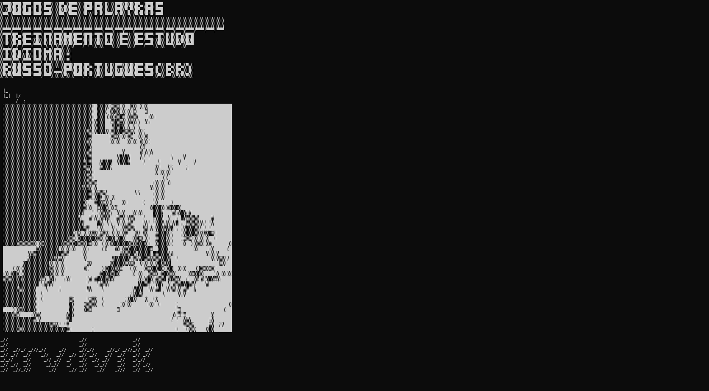
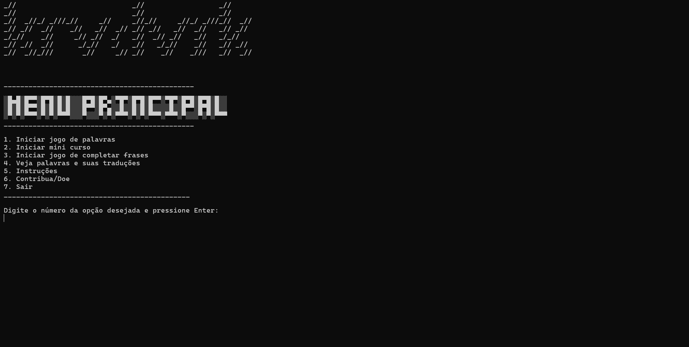
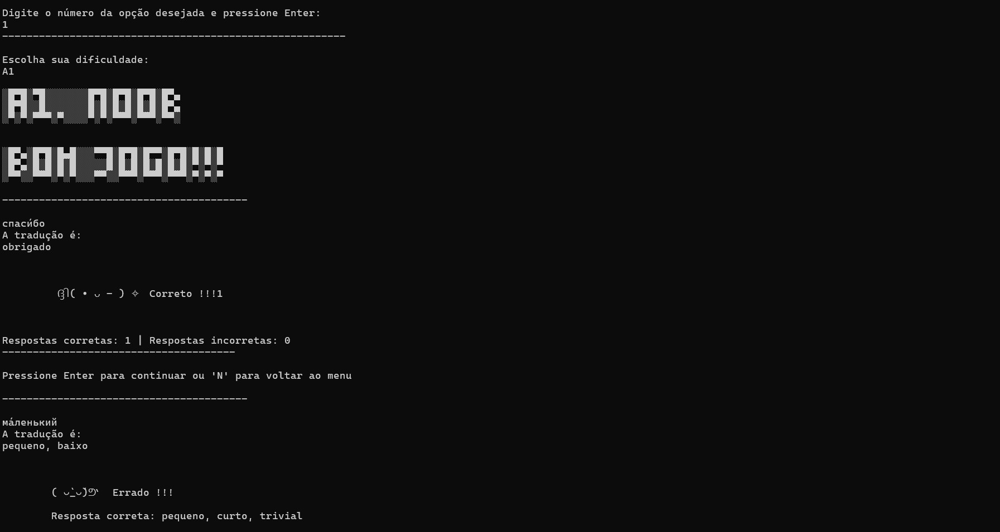
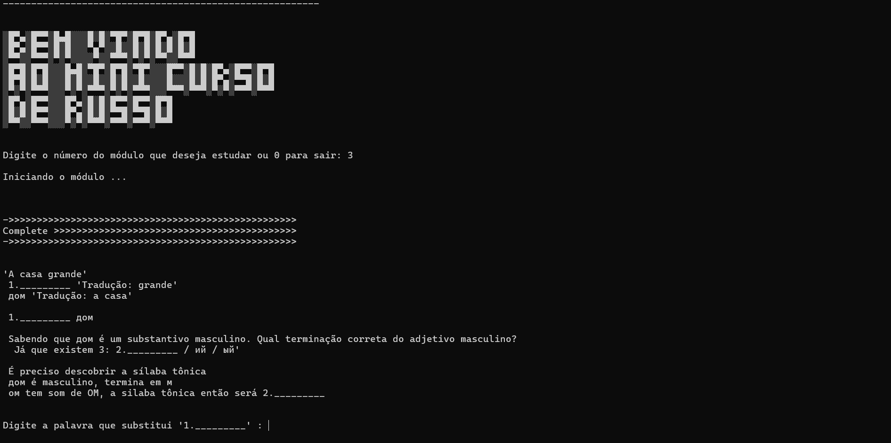
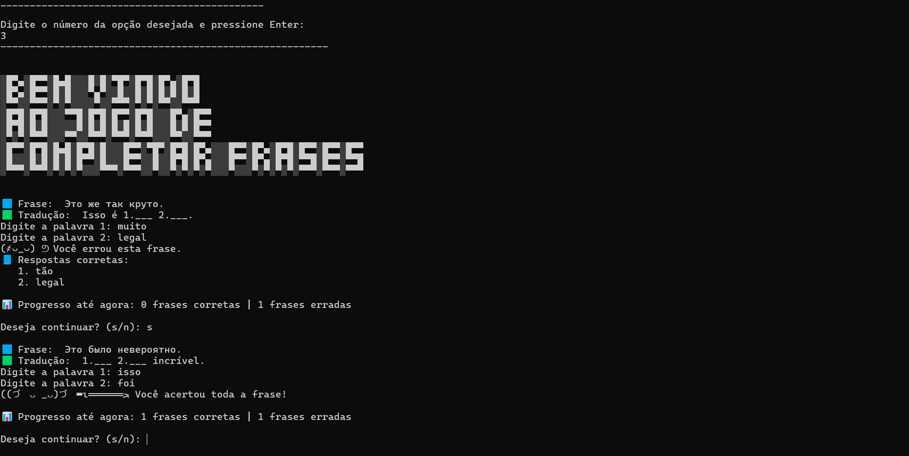
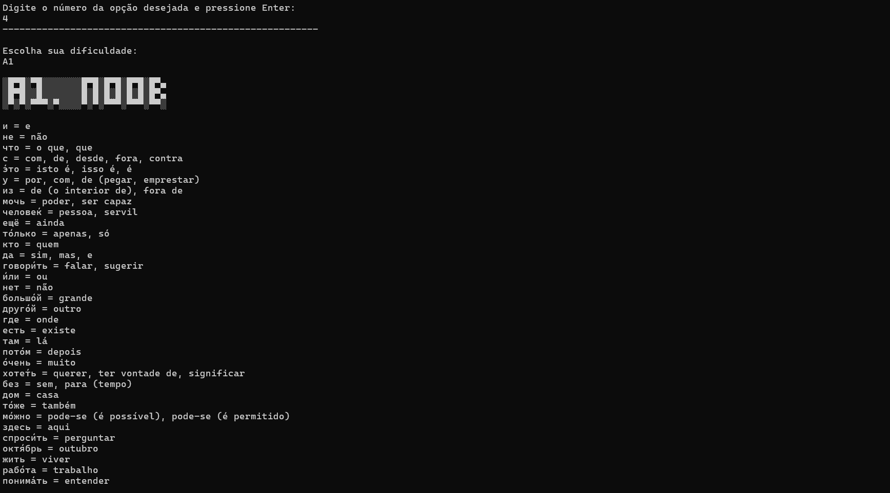

Jogos de palavras. Idioma: RU-PTBR.

Programa em Português do Brasil dedicado ao aprendizado do idioma Russo, onde nele contêm dois jogos de palavras e um mini curso. 

Para executar:
No sistema operacional Windows, baixe o ZIP deste repositório.

    Para abrir o programa basta executar: RUBRJOGO.exe

Capturas de tela do programa:

