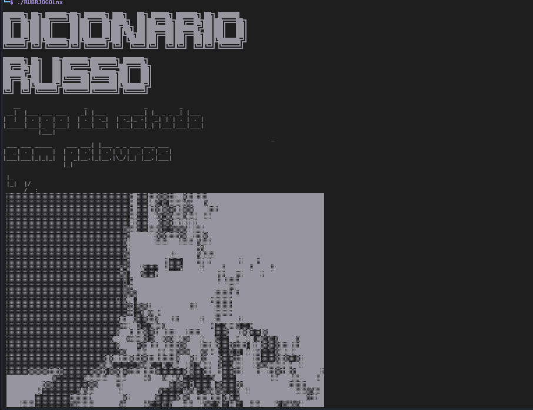
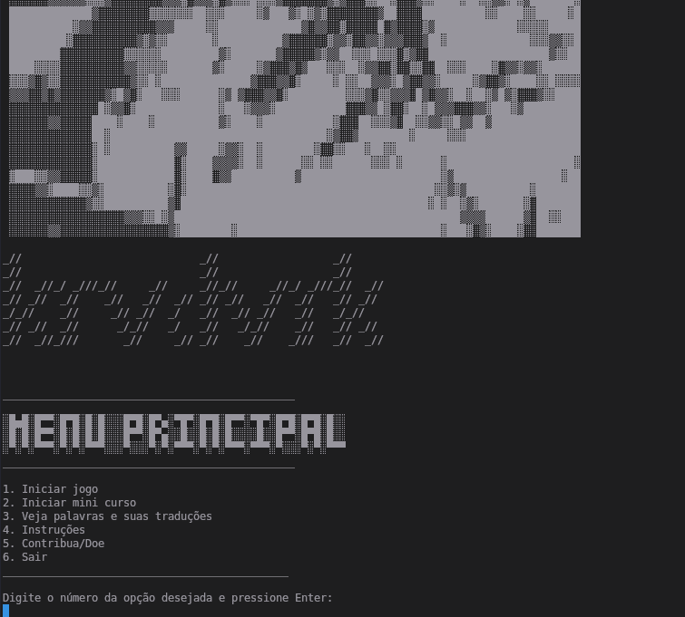
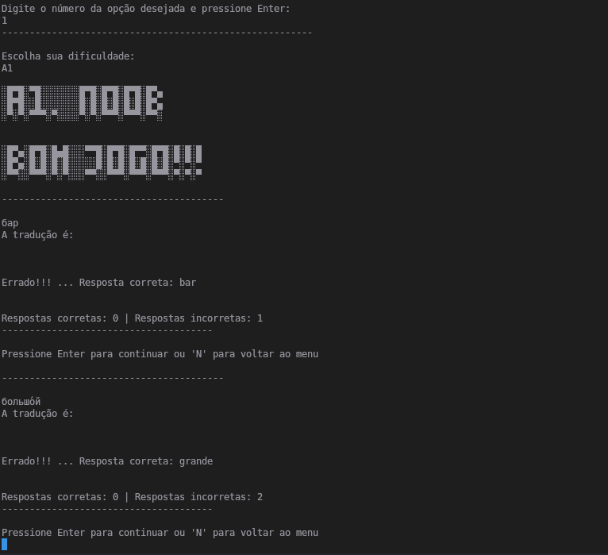
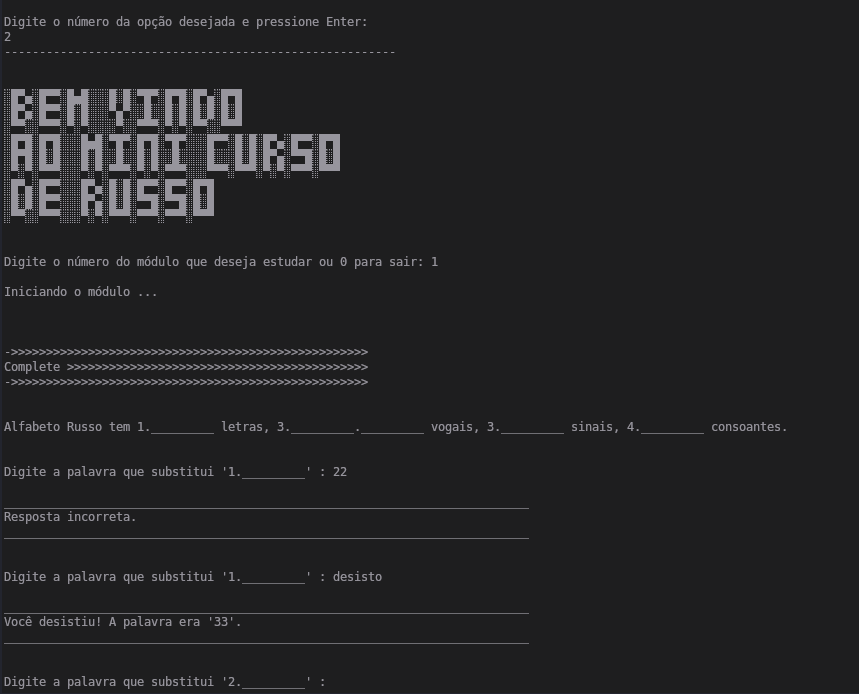
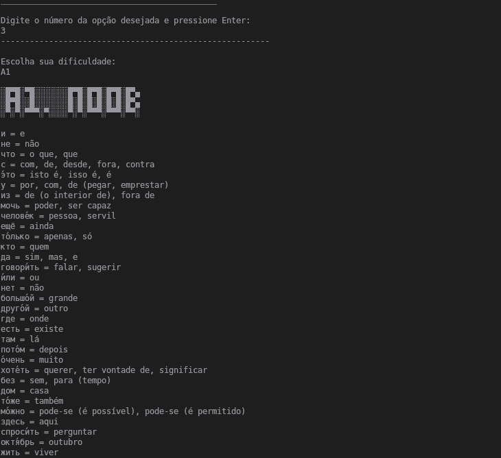

 Olá! Agora em Português do Brasil, o jogo de dicionário da Língua Russa. Inclui também um mini curso para dar um pequeno pontapé
nessa jornada de aprendizado.

Se você estiver no sistema operacional Linux, faça um git clone deste repositório.

    Para abrir o programa, abra o terminal e especifique o caminho para a pasta de arquivos onde você faz o clone. Agora execute o comando -> ./RUBRJOGOLnx

Se você estiver no sistema operacional Windows, baixe o ZIP deste repositório.

    Para abrir o programa basta executar: RUBRJOGOWin.exe

Capturas de tela do programa:

